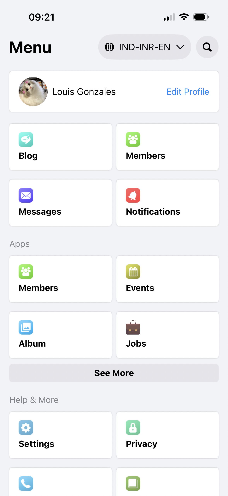
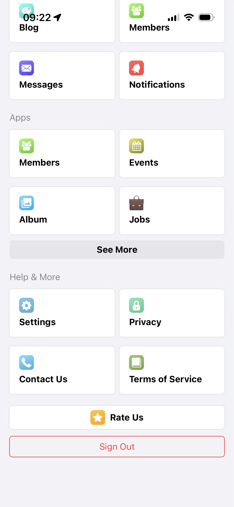
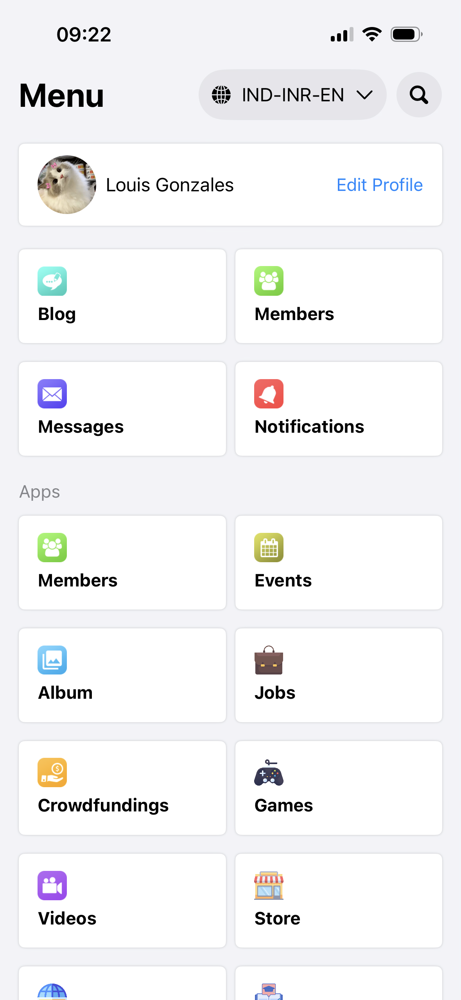
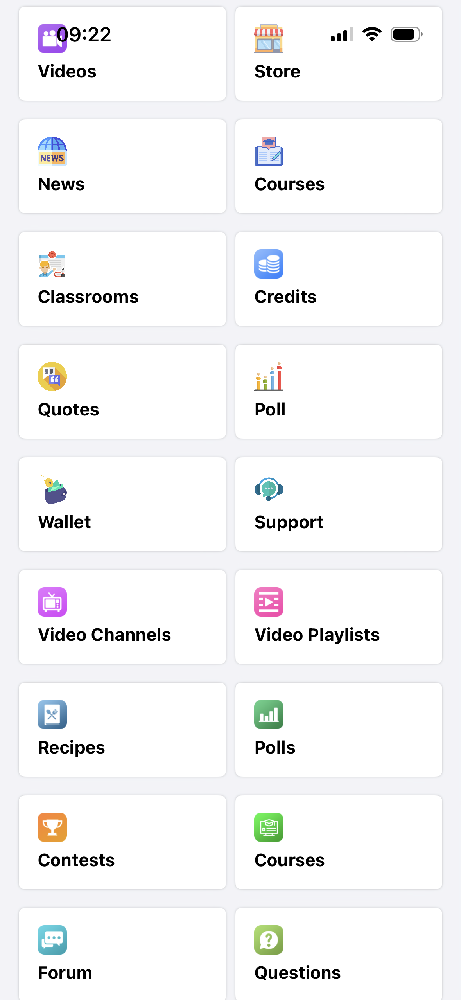
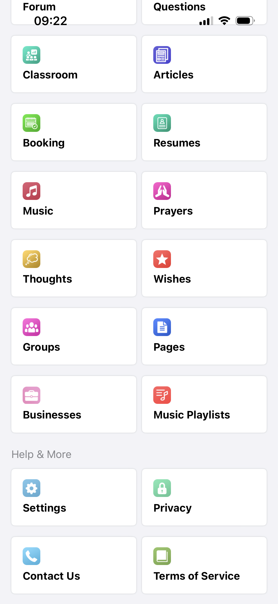
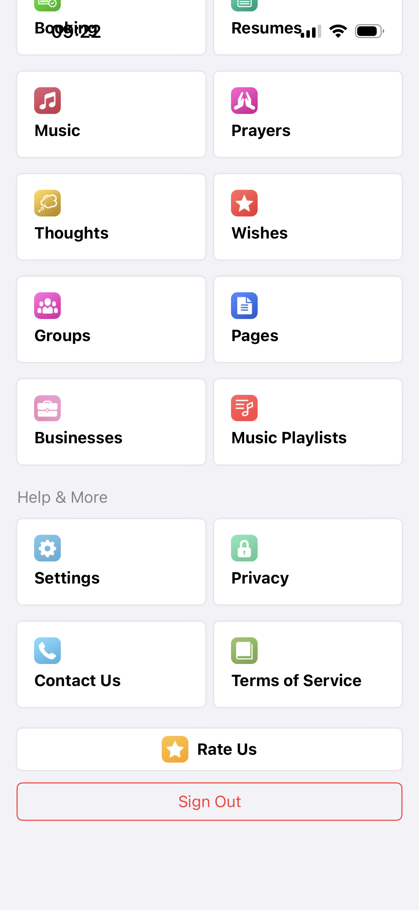

# Assignment - SwiftUI Menu Application

> **Technical Assignment**  
> Developed for **Ahead WebSoft Technologies Pvt Ltd**  
> This project demonstrates SwiftUI, MVVM architecture, and REST API integration

---

## 📱 Project Overview

This is a SwiftUI-based iOS application that displays a dynamic menu interface with sections, collapsible items, and user profile information. The app fetches menu data from a REST API and presents it in a clean, organized two-column grid layout.

### ✨ Key Features

- 🎯 **Dynamic Menu Display** - Sections with organized menu items
- 📦 **Collapsible Sections** - "APPS" section with "See More" functionality (shows 4 items initially)
- 👤 **User Profile** - Profile display with edit option
- ⏳ **Loading States** - Visual feedback during API calls
- 🔄 **Retry Mechanism** - Automatic retry (up to 3 attempts) for failed API requests
- 🎨 **Custom Styling** - Custom background colors and card-based UI
- 📱 **Responsive Grid** - Two-column layout for menu items
- 🖼️ **Async Image Loading** - Remote images loaded asynchronously

---

## 📸 Screenshots

<div align="center">
  

*Main Menu Screen*


*Menu Items Display*


*APPS Section*


*Expanded APPS Section*


*Rate Us and Sign Out Buttons*


*Complete Menu View*

</div>

---

## 🏗️ Architecture

This project follows the **MVVM (Model-View-ViewModel)** architectural pattern:

```
View (SwiftUI) → ViewModel (ObservableObject) → Model (Decodable)
```

### Architecture Layers

- **View Layer**: SwiftUI views and UI components (`Assignment/View/`)
- **ViewModel Layer**: Business logic and state management (`Assignment/ViewModel/`)
- **Model Layer**: Data structures and domain models (`Assignment/Model/`)

---

## 🛠️ Technologies & Frameworks

- **SwiftUI** - Modern declarative UI framework
- **Combine** - Reactive programming for state management
- **Async/Await** - Modern concurrency for API calls
- **URLSession** - Network requests
- **Codable** - JSON decoding

---

## 📂 Project Structure

> **💡 Tip**: For detailed file structure information and navigation guide, see [Agent.md](Agent.md). You can also use `@Agent.md` with AI assistants in your IDE for codebase navigation.

```
Assignment/
├── AssignmentApp.swift          # App entry point
├── ContentView.swift             # Root view with loading overlay
├── Secrets.swift                 # API configuration constants (in .gitignore)
│
├── Model/
│   └── DataModel.swift           # Core data models (DataModel, Result, Menu, MenuSection)
│
├── View/
│   ├── MenuScreen.swift          # Main menu screen
│   │
│   ├── Extensions/
│   │   ├── MenuScreen+Header.swift    # Header bar extension
│   │   └── MenuScren+Buttons.swift   # Button components extension
│   │
│   └── Helpers/
│       ├── BackgroundView.swift       # Custom background view
│       ├── ContentBoxView.swift       # Menu item card component
│       ├── LoadingView.swift          # Loading overlay component
│       └── UserProfile.swift          # User profile component
│
└── ViewModel/
    ├── DataViewModel.swift            # Main view model for menu data
    │
    └── Helpers/
        ├── Helpers.swift               # Debug logging utilities
        └── LoadingAnimationHelper.swift # Loading state singleton
```

---

## 🚀 Getting Started

### Prerequisites

- Xcode 14.0 or later
- iOS 15.0+ (based on SwiftUI features used)
- Swift 5.7+

### Installation

1. Clone the repository:
   ```bash
   git clone <repository-url>
   cd Assignment
   ```

2. Open the project in Xcode:
   ```bash
   open Assignment.xcodeproj
   ```

3. Build and run the project (⌘R)

### Configuration

**API Credentials Setup:**

The API endpoint uses constants from `Secrets.swift` (which is in `.gitignore` for security). However, since this is a public API, you can use these credentials directly:

1. Create `Secrets.swift` in the `Assignment/` directory with the following content:
```swift
import Foundation

let restApi: String = "Sesapi"
let sesapi_platform: Int = 1
let authtoken: String = "B179086bb56c32731633335762"
```

2. The `DataViewModel` will automatically construct the API URL from these constants:
```swift
let apiURL: String = "https://demo.socialnetworking.solutions/sesapi/navigation?restApi=\(restApi)&sesapi_platform=\(sesapi_platform)&auth_token=\(authtoken)"
```

**Note:** The API is publicly accessible, so you can use these credentials directly in your API URL if you prefer not to use `Secrets.swift`.

---

## 📊 API Integration

### Endpoint
The API URL is dynamically constructed in `DataViewModel.apiURL` using constants from `Secrets.swift`:
```
GET https://demo.socialnetworking.solutions/sesapi/navigation?restApi=\(restApi)&sesapi_platform=\(sesapi_platform)&auth_token=\(authtoken)
```

**API Configuration:**
- Base URL: `https://demo.socialnetworking.solutions/sesapi/navigation`
- Query Parameters:
  - `restApi` - API name ("Sesapi")
  - `sesapi_platform` - Platform identifier (1)
  - `auth_token` - Authentication token (URL encoded automatically)

### Response Structure
The API returns a JSON object containing:
- `result.menus[]` - Array of menu items
- `result.notification_count` - Notification count
- `result.friend_req_count` - Friend request count
- `result.message_count` - Message count
- `result.loggedin_user_id` - Logged in user ID
- `session_id` - Session identifier

### Menu Item Types
- **Type 0**: Section header (e.g., "APPS", "HELP & MORE")
- **Type 1**: Regular menu item

### Action Buttons
The API response includes special action buttons at the end of the menu array:
- **Rate Us**: `class == "core_main_sesapi_rate"` - Displayed as white button with icon and shadow
- **Sign Out**: `class == "core_mini_auth"` - Displayed as red bordered button

These are automatically filtered out from regular sections and displayed as full-width buttons at the bottom of the screen.

### Retry Mechanism
- Maximum 3 retry attempts (`maxRetries: Int = 3`)
- 2-second delay between retries (`retryDelay: TimeInterval = 2.0`)
- Automatic retry on network or decoding errors
- Uses `Task.sleep` for delay between retry attempts
- Debug logging for troubleshooting

### Data Transformation
The app transforms the flat menu array into organized sections:
- **`groupedSections`** - Computed property that filters out action buttons and groups items by section headers (type 0)
- **`actionButtons`** - Computed property that extracts Rate Us and Sign Out items for button display
- The "APPS" section is marked as collapsible, showing only 4 items initially

---

## 🎨 UI Components

### Main Views

- **MenuScreen** - Main menu interface with grid layout
  - Two-column `LazyVGrid` for menu items
  - Section-based organization
  - Collapsible "APPS" section with "See More" button
- **ContentView** - Root container with loading overlay
  - Manages global loading state via `LoadingAnimationHelper.shared`
- **UserProfile** - User profile display component
  - Circular profile image
  - User name display
  - "Edit Profile" button

### Reusable Components

- **ContentBoxView** - Menu item card with image and title
  - Async image loading from URL
  - White card with shadow styling
  - Fixed height (80pt)
- **BackgroundView** - Custom background color
  - Light gray background (`rgb(242, 243, 247)`)
  - Applied via `.showBackgroundView()` modifier
- **LoadingView** - Loading overlay with progress indicator
  - Semi-transparent black overlay
  - Centered progress indicator
  - Applied via `.showLoadingView(Bool)` modifier

### View Extensions

- **MenuScreen+Header** - Header bar with menu title and controls
- **MenuScren+Buttons** - Button components extension
  - `SeeMoreButton` - Gray button for expanding collapsible sections
  - `ActionButtonView(menu:)` - Dynamic button styling based on menu item class

### UI Design Notes

⚠️ **Important Notes for Evaluators:**

1. **Profile Image**: Since `loggedin_user_id` was `0` in the API response, a custom placeholder image is used for the profile display instead of fetching from the API.

2. **Fonts**: iOS built-in system fonts are used throughout the app since no custom font pack was provided in the assignment requirements.

3. **Colors**: 
   - Colors have been matched as closely as possible to the design requirements
   - In some cases, RGB values were used for specific color matching
   - Some components use `systemGray` colors which adapt automatically to different shades in dark mode
   - **For best UI evaluation experience, please test the app in Light Mode** as some colors may appear differently in dark mode due to adaptive system colors

---

## 🔄 Data Flow

### API Data Flow
```
1. MenuScreen.onAppear
   ↓
2. Task { await dataViewModel.fetchData() }
   ↓
3. startLoadingAnimation() → LoadingAnimationHelper.shared.isLoading = true
   ↓
4. URLSession.shared.data(from: apiURL)
   ↓
5. JSONDecoder().decode(DataModel.self, from: data)
   ↓
6. dataModel = decodedResponse (on MainActor.run)
   ↓
7. stopLoadingAnimation() → LoadingAnimationHelper.shared.isLoading = false
   ↓
8. groupedSections computed property transforms data
   ↓
9. MenuScreen renders sections in LazyVGrid
```

### State Updates Flow
```
DataViewModel.dataModel (Published)
    ↓
@StateObject in MenuScreen
    ↓
├─ groupedSections computed property (filters action buttons)
│  ↓
│  ForEach renders MenuSection array
│  ↓
│  LazyVGrid displays ContentBoxView items
│
└─ actionButtons computed property (extracts Rate Us & Sign Out)
   ↓
   ForEach renders action buttons
   ↓
   ActionButtonView displays styled buttons
```

### Error Handling Flow
```
On Error:
  ↓
- If retryCount < maxRetries:
  → Task.sleep(retryDelay)
  → fetchData(retryCount: retryCount + 1)
- Else:
  → stopLoadingAnimation()
  → Log max retries reached
```

---

## 📝 Key Features Implementation

### Collapsible Sections
The "APPS" section shows 4 items initially. When "See More" is tapped:
- `isAppsExpanded` state changes to `true`
- All items in the section are displayed
- Smooth state transition

### Loading States
- Global loading state managed by `LoadingAnimationHelper.shared`
- Loading overlay appears during API calls
- Automatically dismissed on success or failure

### Error Handling
- Network errors trigger retry mechanism
- Maximum 3 retry attempts
- Debug logging for troubleshooting

---

## 🧪 Development

### Debug Logging
The project includes a debug logging system:
```swift
debugLog(message: "Your message", type: .info)
```

Log types: `.success`, `.failed`, `.debug`, `.warning`, `.action`, `.info`

### State Management
- `@StateObject` for view model initialization in views
- `@Published` for observable properties in `ObservableObject`
- `@State` for local view state
- Singleton pattern for global state (`LoadingAnimationHelper.shared`)

### Async/Await Pattern
- All API calls use modern `async/await` syntax
- `MainActor.run` ensures UI updates on main thread
- Retry logic implemented with `Task.sleep(nanoseconds:)` for delays
- `Task { }` blocks used in `.onAppear` for async operations
- Functions marked with `@MainActor` for thread-safe loading state updates

### Error Handling
- Network errors trigger automatic retry mechanism
- Maximum 3 retry attempts with 2-second delay
- Debug logging for troubleshooting (only in DEBUG builds)
- Loading states provide visual feedback during API calls

---

## 📚 Documentation

### Codebase Navigation Guide

**To navigate through the codebase and understand its structure, use [Agent.md](Agent.md).**

The `Agent.md` file serves as a comprehensive codebase navigation guide that provides:

- Detailed architecture diagrams
- Complete directory structure with file descriptions
- Comprehensive component descriptions
- Navigation guide for developers and AI agents
- Data flow diagrams
- Conventions and patterns
- Common tasks and solutions
- Important files reference table
- Quick reference guide

#### Using Agent.md with AI Assistants

**For Developers:**
- Use `Agent.md` as a reference to understand the codebase structure and file organization
- Quick navigation to find specific components, view models, or models
- Understand data flow and architectural patterns used in the project

**For AI Agents in IDEs (Cursor, GitHub Copilot, etc.):**
- **Simply add `@Agent.md` in your IDE** when asking AI agents to explain the codebase
- AI agents can use this file to help you navigate through the codebase efficiently
- When you ask questions like "How does the API integration work?" or "Where is the menu screen implementation?", the AI can reference `Agent.md` to provide accurate, contextual answers
- The AI agent can use `Agent.md` to understand the project structure, find files, and explain code relationships

**Example Usage:**
```
You: @Agent.md How does the menu data flow work?
AI: [Will reference Agent.md to explain the data flow from API to UI]
```

### Documentation Methodology

**All aspects of documentation** — including this README.md, Agent.md, and comprehensive code comments throughout the codebase — **have been created using Cursor AI**, following modern smart documentation practices.

This ensures:
- ✅ Consistent documentation style across all files
- ✅ Comprehensive code comments with `// MARK:` separators for better organization
- ✅ Detailed explanations of architecture patterns, data flows, and implementation details
- ✅ AI-friendly documentation that helps both human developers and AI assistants understand the codebase
- ✅ Modern documentation standards that enhance code maintainability and onboarding

---

## 🎯 Assignment Requirements

This project was developed as a **technical assignment** for **Ahead WebSoft Technologies Pvt Ltd**, demonstrating:

✅ SwiftUI proficiency  
✅ MVVM architecture implementation  
✅ REST API integration  
✅ Async/await concurrency  
✅ Error handling and retry mechanisms  
✅ Code organization and best practices  
✅ UI/UX design with custom components  
✅ Computed properties for data transformation  
✅ View extensions for code organization  
✅ Singleton pattern for global state management  

## 📝 Implementation Details

### Architecture Pattern
The project follows **MVVM (Model-View-ViewModel)** architecture:
- **View Layer**: SwiftUI views and UI components (`Assignment/View/`)
- **ViewModel Layer**: Business logic and state management (`Assignment/ViewModel/`)
- **Model Layer**: Data structures conforming to `Decodable` (`Assignment/Model/`)

### Key Implementation Highlights
- **Dynamic URL Construction**: API URL built from constants in `Secrets.swift`
- **Computed Properties**: `groupedSections` and `actionButtons` for data transformation
- **Retry Logic**: Configurable retry mechanism with exponential backoff
- **Global Loading State**: Singleton pattern using `LoadingAnimationHelper.shared`
- **View Extensions**: Organized code using SwiftUI view extensions
- **Debug Logging**: Comprehensive logging system for development

---

## 👤 Author

**Akshat Srivastava**  
Created: January 2026

---

## 📄 License

This project is part of a technical assignment and is intended for evaluation purposes.

---

## 🙏 Acknowledgments

- **Ahead WebSoft Technologies Pvt Ltd** for providing the technical assignment opportunity
- SwiftUI and Apple's development tools
- The demo API endpoint provided for testing

---

## 📞 Support

For questions or issues related to this assignment:
- **Navigate the codebase**: Use [Agent.md](Agent.md) for detailed documentation
- **AI-assisted help**: Add `@Agent.md` in your IDE (Cursor, VS Code, etc.) and ask AI agents to explain any part of the codebase
- **Code comments**: All files contain comprehensive comments with `// MARK:` separators for easy navigation
- For additional support, please contact the development team

---

---

## ⚙️ Configuration & Setup Notes

### API Credentials
- `Secrets.swift` is in `.gitignore` for security best practices
- However, since the API is publicly accessible, the credentials are:
  - `restApi`: "Sesapi"
  - `sesapi_platform`: 1
  - `auth_token`: "B179086bb56c32731633335762"
- You can create `Secrets.swift` with these values or use them directly in the API URL

### Profile Image Note
- Since `loggedin_user_id` in the API response was `0`, a custom placeholder image is used instead of fetching from the API endpoint
- The profile image displayed is a local asset, not from the API

### Design Implementation Notes
- **Fonts**: iOS built-in system fonts are used (no custom font pack provided)
- **Colors**: Colors matched as closely as possible; some RGB values used for accuracy
- **Light Mode Recommended**: For fair UI evaluation, please test in Light Mode as some system colors adapt differently in Dark Mode

---

**Note:** This project is a demonstration of technical skills and follows industry best practices for SwiftUI development.

---

## 🤖 Documentation Credits

All documentation in this project — including this README.md, Agent.md navigation guide, and comprehensive code comments with `// MARK:` separators throughout the codebase — **has been created using Cursor AI**, following modern smart documentation practices.

This AI-assisted documentation ensures:
- Consistent and comprehensive documentation across all files
- Clear code organization with MARK separators
- AI-friendly structure that helps both developers and AI assistants understand the codebase
- Modern documentation standards that enhance code maintainability

**To leverage this documentation:**
- Use `@Agent.md` in your IDE when asking AI agents to explain or navigate the codebase
- Refer to code comments in each file for detailed implementation explanations
- Use MARK separators to quickly navigate between code sections in Xcode
